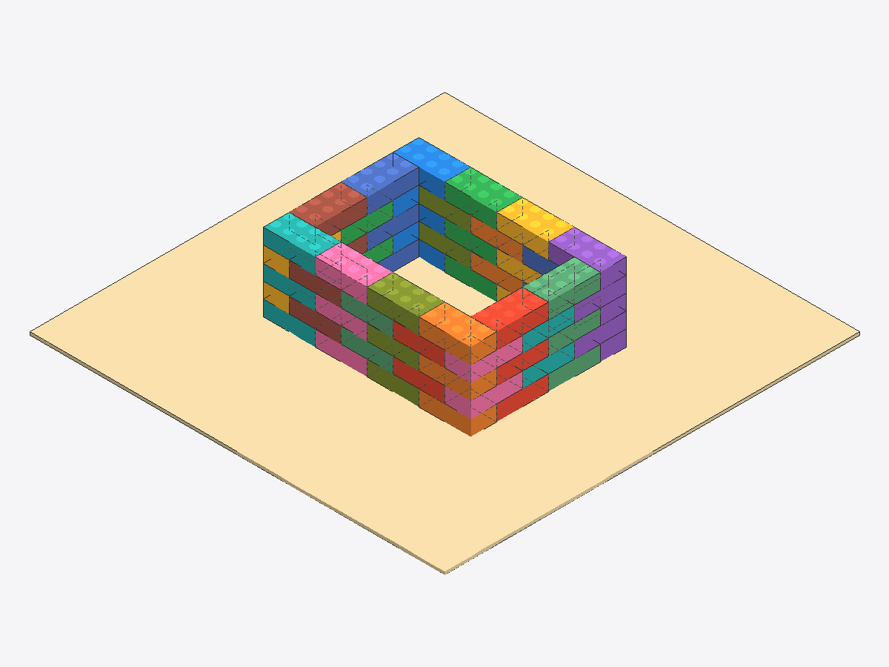
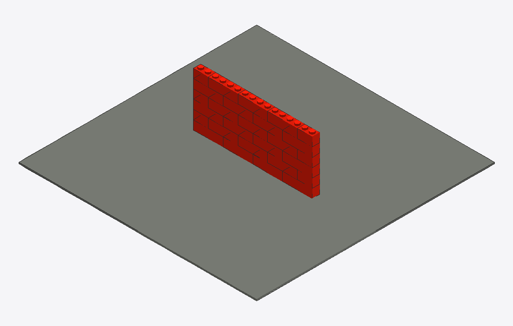
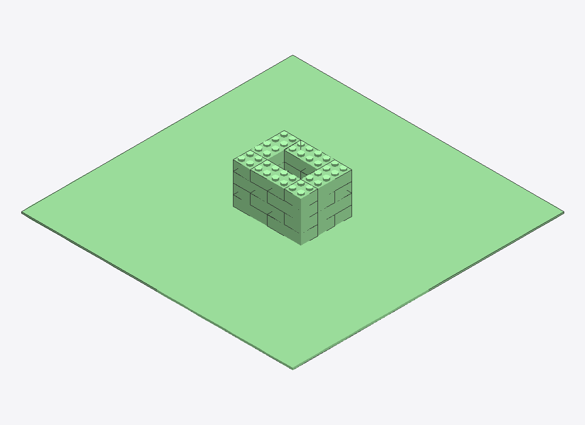
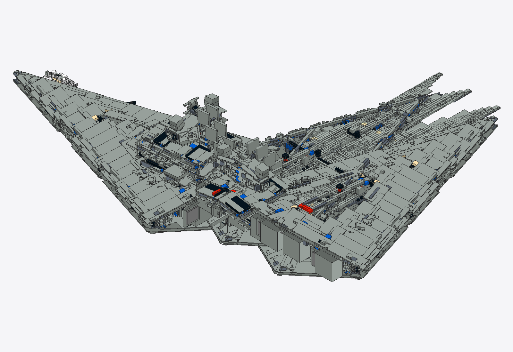
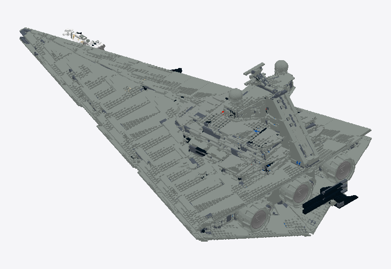
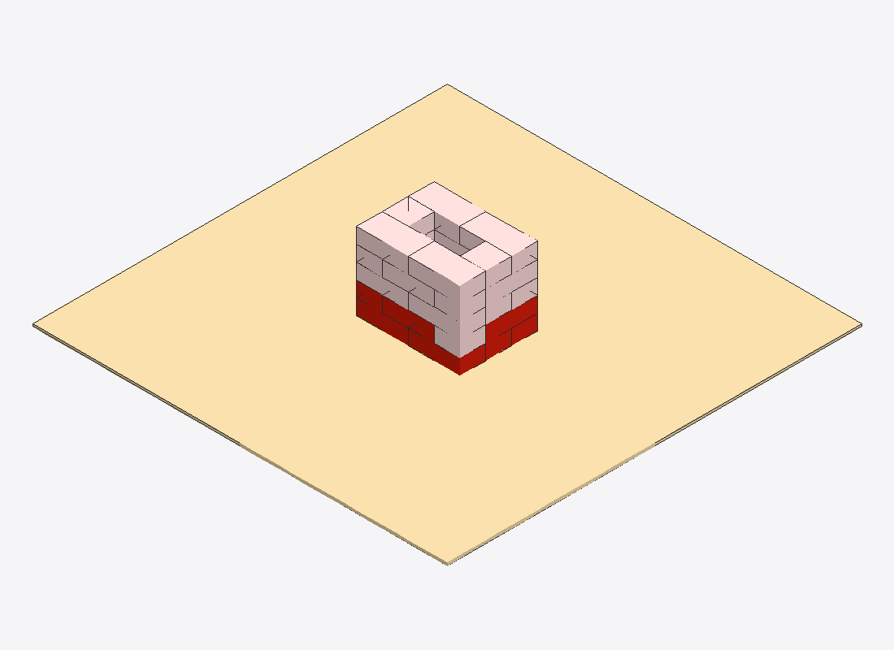

# LegoMCP

An [MCP](https://modelcontextprotocol.io) server that lets an LLM design **buildable** LEGO models by emitting validated LDraw files — not by clicking around in a CAD app.



Drop it into Claude Desktop, ask Claude *"build me a small red house on a tan baseplate,"* and the LLM gets ~50 semantic tools, 6 prompts, and 4 reference resources covering: real LDraw catalog (24,009 parts), buildability checks (no floating / no collisions / no overlaps), connection-aware bonding, builder mode for piece-by-piece assembly, persistent projects, autosave, inline render previews in the chat, and a debug toolkit (`render_validation`, `inspect_part`, `collision_detail`, `describe_errors`). The output is a real `.ldr` / `.mpd` file you can open in [BrickLink Studio](https://www.bricklink.com/v3/studio/download.page) or [LeoCAD](https://www.leocad.org/).

> **Status**: alpha but functional end-to-end. **128 tests passing.** Verified working under Claude Desktop with inline image rendering in chat.

---

## Table of contents

- [Why this exists](#why-this-exists)
- [The non-negotiable rules](#the-non-negotiable-rules)
- [Requirements](#requirements)
- [Install & configure Claude Desktop](#install--configure-claude-desktop)
- [Inline preview modes](#inline-preview-modes-env-var)
- [Coordinate convention](#coordinate-convention-ldraw)
- [The tools, grouped](#the-tools-grouped)
  - [Model state](#model-state)
  - [Placement (raw)](#placement-raw)
  - [High-level helpers (preferred)](#high-level-helpers-preferred)
  - [Catalog & search](#catalog--search)
  - [Connections](#connections)
  - [Subassemblies](#subassemblies)
  - [Validation & debug](#validation--debug)
  - [Rendering](#rendering)
  - [Persistence: checkpoints / projects / autosave](#persistence-checkpoints--projects--autosave)
  - [Builder mode](#builder-mode)
  - [Notes (multimodal context)](#notes-multimodal-context)
  - [Import / export](#import--export)
  - [Undo / redo](#undo--redo)
- [Prompts (slash menu)](#prompts-slash-menu)
- [Resources](#resources)
- [Run as a standalone agent](#run-as-a-standalone-agent-no-claude-desktop)
- [Standalone CLI: `lego-mcp render`](#standalone-cli-lego-mcp-render)
- [Development](#development)
- [Known limitations](#known-limitations)
- [License](#license)

---

## Why this exists

Letting an LLM drive a CAD app via screen automation fails — too many micro-actions, no spatial ground truth, errors compound. LegoMCP gives the LLM a **semantic API**: every action is a typed function call, every change is validated against real LEGO connection rules, every state is reversible. The CAD app becomes the viewer; the MCP server is the source of truth.

## The non-negotiable rules

The toolchain enforces these so what the LLM exports is actually buildable:

1. **Connection rule** — every part either sits on the ground (y ≈ 0) or has at least one stud-receptor mating with a part directly above or below. Anything else is reported as `floating`.
2. **Anchored rule** — connected islands must reach the ground via a chain of connections. A "tower" whose bricks touch each other but the whole thing levitates is reported as `unanchored`.
3. **No overlap** — bricks must not occupy the same AABB. `add_part(strict=True)` rejects overlapping placements at insertion time.
4. **Real geometry** — AABBs, stud positions, and dimensions come from actually-parsed LDraw `.dat` files (recursively through subparts and `stug-NxN` stud-group primitives). A "Brick 2x4" really is 80 LDU × 40 LDU × 24 LDU with 8 studs at the correct positions.

---

## Requirements

- **macOS** (tested) or Linux. Windows should work via WSL; not tested.
- **`uv`** — Python toolchain manager. `brew install uv` (macOS) or `curl -LsSf https://astral.sh/uv/install.sh | sh`.
- **~150 MB disk** for the LDraw parts library (one-time download).
- **Claude Desktop** for the inline-preview workflow. The standalone agent works without it but needs an `ANTHROPIC_API_KEY`.

---

## Install & configure Claude Desktop

```bash
# 1. Clone & install
git clone <this repo> LegoMCP && cd LegoMCP
uv tool install --from . lego-mcp

# 2. Download the full LDraw parts library (~135 MB, one-time, a few minutes)
lego-mcp install-library

# 3. Wire into Claude Desktop. Edit:
#    ~/Library/Application Support/Claude/claude_desktop_config.json
{
  "mcpServers": {
    "lego": {
      "command": "/Users/<you>/.local/bin/lego-mcp",
      "env": {
        "LEGO_MCP_INLINE_MODE": "file_url"
      }
    }
  }
}
```

Replace `<you>` with your username. **Quit Claude Desktop entirely (⌘Q)** and reopen so it spawns the new server.

Verify in any chat: type `/` — you should see a `lego` group with the **start**, **build**, **from_plans**, **from_image**, **rescue**, and **techniques** prompts.

### Renders live here

`~/Library/Application Support/lego_mcp/renders/`

Every `render_model` / `render_progress` / `render_validation` call writes `<timestamp>_<model>.png` (history preserved) and overwrites `latest.png`. Override with `LEGO_MCP_RENDERS_DIR` env var.

Open the latest at any time:
```bash
open "$HOME/Library/Application Support/lego_mcp/renders/latest.png"
```

Preview.app auto-refreshes on file change, so leave it open for live updates.

---

## Inline preview modes (env var)

Set via `LEGO_MCP_INLINE_MODE` in the Claude Desktop config's `env` block.

| Mode | What lands in the chat text | Bytes per render | Use when |
|---|---|---|---|
| **`data_uri`** (default) | `` | ~16 KB | You want inline previews to work in *any* MCP client (web, Desktop, future clients). |
| **`file_url`** (recommended for Claude Desktop) | `` | ~150 bytes | You're on Claude Desktop, which renders local file URLs. ~200× cheaper. |
| **`none`** | nothing | 0 | You only want the LLM-vision `MCPImage` block; no human preview in chat. |

The `MCPImage` block (Claude's vision input) is **always** present regardless of mode — only the human-facing preview text changes.

---

## Coordinate convention (LDraw)

- Right-handed, **-Y is up.**
- 1 stud = **20 LDU** wide. 1 plate = **8 LDU** tall. 1 brick = **24 LDU** tall (= 3 plates).
- Part origins are at the **center of the bottom face.**
- A baseplate (3811) at y=0 has its top face at y=-4. A brick sitting on it has its bottom face at y=-4.
- Stack a brick on top of another by subtracting 24 from y.
- A "Brick A x B" has its longer axis along +X. So a 2x4 brick is 80 LDU (X) × 40 LDU (Z) × 24 LDU tall.

Rotations are **named**, not matrices: `identity`, `rot90y`, `rot180y`, `rot270y`, `rot90x`, `rot90z`.

---

## The tools, grouped

50 tools total. **The recommended order of preference when the LLM is building**: high-level helpers → semantic placement → raw `add_part` only as a debug fallback. Each call shows the **most useful arguments**; full signatures are in the tool docstrings.

### Model state

| Tool | What it does |
|---|---|
| `create_model(name)` | Reset to a fresh empty model. |
| `list_parts(limit, subassembly)` | List current parts (optionally filtered to one subassembly). |

### Placement (raw)

| Tool | What it does |
|---|---|
| `add_part(part_id, color, x, y, z, rotation, strict=False)` | Explicit placement. `strict=True` rejects overlap/floating at insertion. |
| `remove_part(instance_id)` | Delete by id. |
| `move_part(instance_id, x, y, z)` | Reposition. |
| `rotate_part(instance_id, rotation)` | Change orientation. |

### High-level helpers (preferred)

These encode real LEGO masonry/architecture techniques so the LLM doesn't have to compute stagger/corners/seams by hand. Strict-grid by default; reject off-grid coords.



*`build_wall_segment(..., bond="running")` — each row's seams shift by half a brick from the row below.*

| Tool | What it does |
|---|---|
| `build_wall_segment(x0, z0, x1, z1, height_rows, color, bond, base_y, palette)` | Straight wall with `running` / `stretcher` / `stack` bond. End-fills with shorter bricks; tracks seams so adjacent rows don't share them. |
| `build_room(x_min, z_min, x_max, z_max, height_rows, color, bond, base_y)` | Rectangular hollow room. 4 staggered walls + 2x2 corner columns. |
| `build_perimeter(points, height_rows, color, bond, base_y)` | Closed orthogonal outline (any rectilinear footprint from a plan/image). Alternates corner ownership by row. |
| `build_wall_with_openings(x0, z0, x1, z1, height_rows, color, openings=[...])` | Straight wall with rectangular / round-arch / lancet openings. |
| `build_stepped_gable_roof(...)` / `build_stepped_pyramid_roof(...)` | Connector-aware roofs. |
| `build_floor(x_min, z_min, x_max, z_max, y, color, part_id)` | Tile a rectangle with plates. |
| `build_corner(x, z, height_rows, color, brick_part)` | One-corner column (for hand-built rooms). |
| `place_on_top(base_id, new_part_id, color, stud_offset_x, stud_offset_z, rotation)` | Stud-grid stacking from a known anchor. |
| `place_next_to(reference_id, new_part_id, color, side, stud_offset, rotation)` | Flush placement (north/south/east/west of an existing part). |
| `repeat_pattern(part_id, count, dx, dy, dz, ...)` | Array of identical parts along a line. |

### Catalog & search

| Tool | What it does |
|---|---|
| `search_parts(query, limit=20)` | Keyword search over the 24k catalog. AND-of-tokens; use single concrete words ("arch", "wheel", "window"). |
| `get_part_info(part_id)` | Dimensions, stud count, `bbox_local`, AND for slopes an `orientation` block (`high_edge`, `low_edge`, plain-text summary) so you don't have to guess after rotation. |
| `list_colors()` | The 22 named colors + LDraw IDs. |
| `parts_that_mount_on(part_id, limit=20)` | **Reverse** mount search. Footprint-bucketed index over the full catalog; first call builds index (~1s), then queries are ~ms. |

### Connections

| Tool | What it does |
|---|---|
| `find_connections(a, b, full_nesting_only=False, min_studs_matched=1)` | Every valid placement of B-on-A and A-on-B. |
| `find_valid_placements(part_id, near_part_id)` | Same but in world coords relative to an existing part instance. |
| `suggest_next_brick_for_wall(subassembly)` | Heuristic next-brick suggester (Phase 1 stub). |

### Subassemblies

| Tool | What it does |
|---|---|
| `set_current_subassembly(name)` | Tag subsequent additions with a group name. |
| `list_subassemblies()` | Names + counts. |
| `remove_subassembly(name)` | Delete every part with the tag. |
| `clone_subassembly(src, dst, x_offset, y_offset, z_offset)` | Duplicate a built component. |
| `mirror_subassembly(src, dst, axis, plane_offset)` | Bilateral symmetry — build half a cathedral, mirror it. |
| `analyze_assembly_ports(subassembly)` | Exposed studs/receivers on a built module. |
| `find_subassembly_connections(movable, target)` | Where one module can connect to another. |
| `move_subassembly(name, dx, dy, dz)` | Translate a whole group. |

### Validation & debug

| Tool | What it does |
|---|---|
| `validate_model(max_errors=200, check_support=True)` | The 9-field report: parts, connections, collisions, unknown_parts, floating, unanchored, grid_alignment_errors, vertical_seam_score, wall_bond_quality. Errors include `suggestion` strings. |
| `inspect_part(instance_id, neighbor_studs=2)` | Focused diagnostic for ONE part: position, AABB, rotation, subassembly, validation flags, who it collides with (with overlap region + smallest separation), who it's connected to, who's nearby in XZ. |
| `collision_detail(part_a, part_b)` | For a flagged pair: overlap AABB, volume, smallest separating translation per axis, one-line "Move part X by Y LDU on Z to clear" suggestion. |
| `describe_errors(max_errors=10)` | Bulk-enriches every `validate_model` error with `inspect_part` / `collision_detail` context in one round-trip. |

### Rendering

All four return `[markdown_preview, summary_dict, MCPImage]` — the human sees the inline image, the LLM sees the image via its vision channel.

| Tool | What it does |
|---|---|
| `render_model(width=800, height=600, color_mode="model", hidden_edges=True)` | Isometric PNG. `color_mode`: `"model"` (actual colors), `"instance"` (one color per piece, for debugging), `"row"` (color by brick course), `"rotation"` (color by orientation). |
| `render_progress(width, height, color_mode, hidden_edges)` | Builder-mode render: built parts solid, unbuilt as ghosts. |
| `render_validation(width=900, height=700)` | Color-codes each part by validation status: **green** = ok, **red** = collision, **orange** = floating, **purple** = unanchored, **yellow** = off-grid, **gray** = unknown part_id. The one-shot "where are my problems?" view. |
| `view_latest_render()` | Re-show the most recent render without re-rendering. |



*`render_validation()` on a clean `build_room`: every part is green — no collisions, nothing floating, nothing off-grid. When something is wrong, the offending parts switch color (**red** = collision, **orange** = floating, **purple** = unanchored, **yellow** = off-grid, **gray** = unknown part_id) so you can spot problems at a glance.*

#### Stress test: importing a 9,361-part Star Destroyer

`import_ldr("10030-1.mpd")` followed by `render_model(1600, 1100)` on the **Imperial Star Destroyer (set 10030)** — 9,361 parts across 135 sub-modules, ~7,290 of them carrying non-canonical rotation matrices (the angled hull plating). Import: **0.09 s**. The two renders below are the same scene from the same camera, using two different rendering strategies:



*🪨 **AABB renderer (default, currently in the codebase)** — every part is drawn as its world-space bounding cuboid. Useful: the silhouette and scale are correct, every imported part is positioned and rotated faithfully, and you can see at a glance whether the loader walked the sub-module hierarchy correctly. Limitation: curves, slopes, and engine details all live as triangle/quad geometry inside the `.dat` files we're not reading yet, so the ship looks like a stack of grey blocks. ~5.3 s render → 140 KB PNG.*



*✨ **Mesh-based renderer (in progress)** — reads real LDraw triangle/quad geometry directly from each `.dat` file and projects it. Same scene, same camera, same parsing pipeline — just hooked up to the catalog's actual geometry. The bridge superstructure, antenna dishes, engine block, and angled hull plating all render in true shape. This is what the renderer aims for; the AABB path stays as the fast fallback for when the library isn't installed.*

> Builder mode isn't trained to design anything this complex yet — semantic tools for greebling, wing-plate panel boundaries, and curved-hull techniques are future work. But the **import + render path holds up at this scale** today: you can load any OMR model, inspect it, run validation on it, and start chipping away.
>
> LDraw model © Roland Dahl ([rolandd on the LDraw OMR](https://library.ldraw.org/omr/sets/308)), redistributable under [CCAL 2.0](https://www.ldraw.org/article/398.html). Downloaded from [library.ldraw.org/library/omr/10030-1.mpd](https://library.ldraw.org/library/omr/10030-1.mpd). The Imperial Star Destroyer is a trademark of Lucasfilm / The Walt Disney Company.

### Persistence: checkpoints / projects / autosave

Three tiers — pick the right one:

| Tier | Tool | Use when |
|---|---|---|
| **Checkpoint** (in-memory, instant) | `save_checkpoint(name)` / `restore_checkpoint(name)` / `list_checkpoints()` | Before a risky change. Lost on restart. |
| **Project** (on-disk, named) | `save_project(name)` / `load_project(name)` / `list_projects()` | A meaningful intermediate you want to keep. Multi-block MPD + JSON notes. Survives restart. |
| **Autosave** (automatic) | `autosave_status()` / `restore_autosave()` | Every 25 mutations, the model is dumped to `_autosave.mpd`. After a crash, call `restore_autosave()` to pick up where you left off. |

### Builder mode

Walk a finished target model piece by piece (for a human or robot to physically assemble).



*`render_progress()` mid-build: the bottom row of the target room is placed (solid red), the rest of the target shows as faded ghosts so you know what's still to come.*

| Tool | What it does |
|---|---|
| `start_builder_session()` | Snapshot becomes the target; built set clears. After this, new `add_part` calls add to target, not built. |
| `end_builder_session(mark_all_built=True)` | Exit builder mode. |
| `builder_status()` | Quick snapshot: total / built / remaining / next_up part / blocked count / complete? |
| `next_unbuilt_step(limit=1)` | The next placeable unbuilt parts (only treats already-built parts as supporters). |
| `mark_built(id)` / `mark_built_batch(ids)` / `unmark_built(id)` / `reset_build_progress()` | Walk forward / back / start over. |
| `plan_build_sequence(subassembly, max_steps=50, start_after=0)` | Compile the whole target into a paged step list. |
| `next_build_step(subassembly, built_count=0)` | Same as above but per-call (compatible with `plan_build_sequence`). |
| `render_progress()` | See built-solid + unbuilt-ghost in one image. |

### Notes (multimodal context)

For workflows where Claude is reading a plan / photo and needs to remember dimensions across many turns.

| Tool | What it does |
|---|---|
| `add_note(key, text)` / `get_note(key)` / `list_notes()` / `remove_note(key)` | Sticky observations keyed by short string. Notes travel with the project (saved by `save_project`). |

### Import / export

| Tool | What it does |
|---|---|
| `export_ldr(path)` / `export_mpd(path)` | Write to disk. Relative paths land in the renders dir (so it works under Claude Desktop's read-only cwd). |
| `import_ldr(path)` | Load an `.ldr` or `.mpd`. Multi-block MPDs are flattened with subassembly tags preserved. |

### Undo / redo

| Tool | What it does |
|---|---|
| `undo()` / `redo()` | O(1) operation-based. Last 500 mutations. |

---

## Prompts (slash menu)

Invoke from Claude Desktop's `/` menu. Each one seeds the conversation with the right context.

| Prompt | What it does |
|---|---|
| **`start`** | Open this first in a new session. Full one-page reference: every tool, the build/validate/render loop, the three save tiers, builder mode. |
| **`build`** *(goal, scale)* | Generic "build X" prompt with the workflow + techniques. |
| **`from_plans`** *(subject)* | Multimodal cathedral-style build: upload plans, decompose into subassemblies, build half + mirror. |
| **`from_image`** | Build from an uploaded reference photo. |
| **`rescue`** *(path)* | Load an existing model, clean it up, fix collisions. |
| **`techniques`** | Print the LEGO techniques cheat sheet (running/English bond, SNOT, MILS, etc). |

## Resources

Read-only references the LLM can fetch with `resources/read`.

| URI | Content |
|---|---|
| `lego://techniques` | LEGO building techniques cheat sheet |
| `lego://coords` | LDraw coordinate convention reference |
| `lego://workflow` | The build/validate/render loop |
| `lego://model/current` | Live state of the current model (JSON) |

---

## Run as a standalone agent (no Claude Desktop)

```bash
uv sync --extra agent
export ANTHROPIC_API_KEY=sk-ant-...
uv run python -m lego_mcp.agent "build me a 16x12 stud room, 5 bricks high"
```

The agent spawns `lego-mcp` as a subprocess, fetches the tool list over MCP JSON-RPC, hands the tools to Claude via the Anthropic SDK, and loops until Claude stops calling tools. Final model exported to `./agent_build.mpd` and rendered.

---

## Standalone CLI: `lego-mcp render`

For when you want to render an `.ldr` / `.mpd` file from the shell — previewing an OMR download, batching renders for a website, generating a turntable, or just sanity-checking a model someone sent you — without spinning up the MCP server or opening Claude Desktop.

```bash
lego-mcp render path/to/model.mpd                          # writes model.png next to the input
lego-mcp render model.mpd -o /tmp/out.png -w 1600 -H 1100  # explicit output + dimensions
lego-mcp render model.mpd --color-mode instance            # one color per piece (debug)
lego-mcp render model.mpd --hidden-edges                   # show internal contact faces as dotted lines
lego-mcp render model.mpd --view-angle 90                  # camera 90° around the Y-axis
lego-mcp render model.mpd --turntable 24                   # 24 frames sweeping 360° → model_000.png … model_023.png
lego-mcp render model.mpd --background "#0a0a0a"           # dark background
lego-mcp render model.mpd \
    --watermark "ACME © 2026" \
    --watermark-position bottom-right \
    --watermark-color "#ffffff" \
    --watermark-opacity 200
lego-mcp render --help                                     # full help
```

All flags:

| Flag | Default | What it does |
|---|---|---|
| `<input>` *(positional)* | — | Path to an `.ldr` or `.mpd` file. |
| `-o, --output PATH` | `<input-stem>.png` next to input | Output PNG path. |
| `-w, --width N` | `1200` | Image width in pixels. |
| `-H, --height N` | `900` | Image height in pixels. (`-h` is reserved for help.) |
| `--color-mode {model,instance,row,rotation}` | `model` | `model` = actual colors; `instance` = one color per piece; `row` = color by brick course; `rotation` = color by orientation. |
| `--hidden-edges` | off | Draw fully-covered contact faces as dotted guide lines. |
| `--view-angle DEG` | `0` | Camera azimuth (yaw around Y). 0 = default iso view; `45` rolls to a flat front elevation; `90` shows the next corner. Pitch stays at 30°. |
| `--turntable N` | — | Instead of one image, write **N frames** sweeping 360°. Each frame goes to `<stem>_NNN.png`. Overrides `--view-angle`. |
| `--background #RRGGBB` | `#f5f5f8` | Image background color. Accepts `#fff` shorthand. |
| `--watermark TEXT` | — | Overlay text on the rendered image. |
| `--watermark-position {top-left,top-right,bottom-left,bottom-right}` | `bottom-right` | Where to draw the watermark. |
| `--watermark-color #RRGGBB` | `#282828` | Watermark text color. |
| `--watermark-opacity N` | `140` | Watermark alpha (0 transparent .. 255 opaque). |
| `--watermark-size N` | `18` | Watermark font size in px. |
| `--watermark-margin N` | `14` | Watermark distance from image edges, in px. |
| `-q, --quiet` | off | Suppress progress lines on stdout. |

The watermark draws with a TTF font when one is available (Helvetica / Arial / DejaVu probed in order), falling back to PIL's bitmap default on minimal systems so it never hard-fails.

### One-liner recipes

```bash
# Generate a hero image for a model with a tagline
lego-mcp render hero.mpd -o hero.png -w 1920 -H 1080 \
    --watermark "Built with LegoMCP" --watermark-opacity 90

# Compare two color modes side-by-side (re-run with different --color-mode)
lego-mcp render m.mpd -o m_model.png   --color-mode model
lego-mcp render m.mpd -o m_instance.png --color-mode instance

# Spin a 36-frame turntable for an animation
lego-mcp render m.mpd --turntable 36 -o /tmp/spin.png
# → /tmp/spin_000.png … /tmp/spin_035.png — feed into ffmpeg / a GIF tool
```

---

## Development

```bash
uv sync --extra dev --extra agent
uv run pytest            # 128 tests including a real MCP stdio handshake
```

Architecture and decisions live in [NOTES.md](NOTES.md).

### Project layout

```
src/lego_mcp/
├── server.py           # FastMCP tools + state + tool dispatch
├── parts.py            # LDraw .dat parser + catalog + index cache
├── render.py           # Built-in isometric renderer w/ studs + sub-faces
├── helpers.py          # build_wall / build_room / build_floor / place_on_top / ...
├── connections.py      # Stud-receptor mating combinatorics
├── connection_graph.py # Floating + unanchored detection via BFS
├── mount_index.py      # Reverse mount search (footprint-bucketed)
├── connectors.py       # Typed connector model (Phase 1: stud-only)
├── assembly_ports.py   # Module-level exposed-port analysis
├── build_steps.py      # Build sequencing (whole + partial-vs-target)
├── prompts.py          # 6 prompts + 4 resources
├── agent.py            # Standalone Claude-driven agent
└── __main__.py         # `lego-mcp` CLI: server / install-library / --help

tests/                  # 128 tests, pytest
```

---

## Known limitations

- **Slope renderer is AABB.** Slopes draw as cuboids. Use `get_part_info(slope_id)`'s `orientation` block to reason about slope direction — that's the bigger reasoning win. True wedge geometry is a planned follow-up.
- **Non-canonical-rotation parts are drawn as oriented cuboids** — the matrix is preserved, the box rotates correctly, but those parts don't participate in stud-mating connection analysis (the grid only makes sense axis-aligned). Fine for imported display, intentionally limited for new construction.
- **Search is keyword-AND.** "vehicle base car chassis" returns 0; "chassis" alone returns lots. Workaround: use single concrete words. Semantic search is on the roadmap.
- **Connection model is stud-only.** Pins / hinges / axles / clips need `!LDCAD CONN` parsing (LDCad-extended LDraw metadata). Phase 2.
- **`mount_index` ranking is footprint-naive.** Often surfaces minifig-leg variants for small targets because they happen to share the footprint. A "kind=" filter (brick/plate/tile vs accessory) would help.
- **No physics.** A structurally-unsound model that's geometrically connected still passes validation.

See [NOTES.md](NOTES.md) for the full decision log + deferred items.

---

## License

MIT. See [LICENSE](LICENSE).
